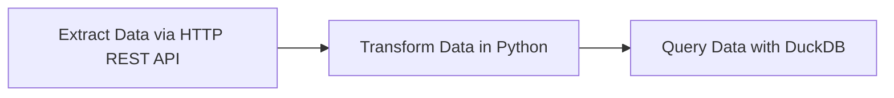
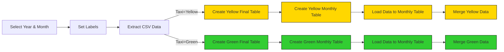
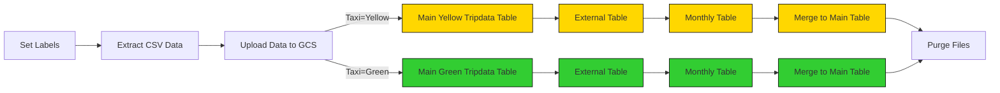
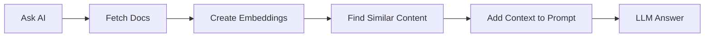

# Workflow Orchestration

Welcome to Module 2 of the Data Engineering Zoomcamp! This week, we’ll dive into workflow orchestration using [Kestra](https://go.kestra.io/de-zoomcamp/github). 

Kestra is an open-source, event-driven orchestration platform that simplifies building both scheduled and event-driven workflows. By adopting Infrastructure as Code practices for data and process orchestration, Kestra enables you to build reliable workflows with just a few lines of YAML.

> [!NOTE]  
>You can find all videos for this week in this [YouTube Playlist](https://go.kestra.io/de-zoomcamp/yt-playlist).

---

## Course Structure

- [2.1 - Introduction to Workflow Orchestration](#21-introduction-to-workflow-orchestration)
- [2.2 - Getting Started With Kestra](#22-getting-started-with-kestra)
- [2.3 - Hands-On Coding Project: Build ETL Data Pipelines with Kestra](#23-hands-on-coding-project-build-data-pipelines-with-kestra)
- [2.4 - ELT Pipelines in Kestra: Google Cloud Platform](#24-elt-pipelines-in-kestra-google-cloud-platform)
- [2.5 - Using AI for Data Engineering in Kestra](#25-using-ai-for-data-engineering-in-kestra)
- [2.6 - Bonus](#26-bonus-deploy-to-the-cloud-optional)


## 2.1 Introduction to Workflow Orchestration

In this section, you’ll learn the foundations of workflow orchestration, its importance, and how Kestra fits into the orchestration landscape.

### 2.1.1 - What is Workflow Orchestration?
  
Think of a music orchestra. There's a variety of different instruments. Some more than others, all with different roles when it comes to playing music. To make sure they all come together at the right time, they follow **a conductor who helps the orchestra to play together.**

Now replace the instruments with **tools** and the conductor with **an orchestrator**. We often have multiple tools and platforms that we need to work together. Sometimes on a **routine schedule**, other times based on **events that happen**. That's where the orchestrator comes in to help all of these tools work together.

A workflow orchestrator might do the following tasks:
- **Run workflows which contain a number of predefined steps**
- **Monitor and log errors**, as well as taking a number of extra steps when they occur
- Automatically run workflows based on **schedules and events**

In data engineering, you often need to move data from one place, to another, sometimes with some modifications made to the data in the middle. This is where a workflow orchestrator can help out by managing these steps, while giving us visibility into it at the same time. 

In this module, we're going to build our own data pipeline using ETL (Extract, Transform Load) with Kestra at the core of the operation, but first we need to understand a bit more about how Kestra works before we can get building! 

#### Videos
- **2.1.1 - What is Workflow Orchestration?**  
  [](https://youtu.be/-JLnp-iLins)


### 2.1.2 - What is Kestra?

Kestra is an open-source, infinitely-scalable orchestration platform that enables all engineers to manage business-critical workflows. 

Kestra is a great choice for workflow orchestration:
- Build with **Flow code (YAML), No-code or with the AI Copilot** - flexibility in how you build your workflows
- 1000+ Plugins - integrate with all the tools you use
- Support for any programming language - pick the right tool for the job
- Schedule or Event Based Triggers - have your workflows respond to data

#### Videos

- **2.1.2 - What is Kestra?**  
  [](https://youtu.be/ZvVN_NmB_1s)

### Resources
- [Quickstart Guide](https://go.kestra.io/de-zoomcamp/quickstart)
- [What is an Orchestrator?](https://go.kestra.io/de-zoomcamp/what-is-an-orchestrator)

---

## 2.2 Getting Started with Kestra

In this section, you'll learn how to install Kestra, as well as the key concepts required to build your first workflow. Once our first workflow is built, we can extend this further by executing a Python script inside of a workflow. 

You will:
1. Install Kestra using **Docker Compose**
2. Learn the concepts of Kestra to build your first workflow
3. Execute a Python script inside of a Kestra Flow

### 2.2.1 - Installing Kestra

To install Kestra, we are going to use Docker Compose. We already have a Postgres database set up, along with pgAdmin from Module 1. We can continue to use these with Kestra but we'll need to make a few modifications to our Docker Compose file.

Use [this example Docker Compose file](docker-compose.yml) to correctly add the **2 new services and set up the volumes correctly.**

Add information about setting a **username and password.**

We'll set up Kestra using Docker Compose containing **one container for the Kestra server and another for the Postgres database (containing Kestra workflow metadata):**

```bash
cd 02-workflow-orchestration
docker compose up -d


@kaiquanmah0 ➜ /workspaces/data-engineering-zoomcamp-homework/02-workflow-orchestration (main) $ docker compose up -d
[+] Running 10/10
 ✔ kestra Pulled                                                                                                                                                 125.5s 
   ✔ 7e49dc6156b0 Pull complete                                                                                                                                    2.9s 
   ✔ e10875650961 Pull complete                                                                                                                                   46.4s 
   ✔ 4be944c6b743 Pull complete                                                                                                                                   50.1s 
   ✔ 82f0f6707dd1 Pull complete                                                                                                                                   50.1s 
   ✔ 55135a7213f6 Pull complete                                                                                                                                   50.1s 
   ✔ 4cdfe544c17b Pull complete                                                                                                                                   50.2s 
   ✔ 8ec52ec379f1 Pull complete                                                                                                                                   50.2s 
   ✔ 1b46c0f9cff8 Pull complete                                                                                                                                   52.8s 
   ✔ a6d5882add6c Pull complete                                                                                                                                  121.6s 
[+] Running 7/7
 ✔ Volume 02-workflow-orchestration_kestra_postgres_data   Created                                                                                                 0.0s 
 ✔ Volume 02-workflow-orchestration_kestra_data            Created                                                                                                 0.0s 
 ✔ Volume 02-workflow-orchestration_ny_taxi_postgres_data  Created                                                                                                 0.0s 


 ✔ Container 02-workflow-orchestration-pgdatabase-1        Started                                                                                                 1.7s 
 ✔ Container 02-workflow-orchestration-kestra_postgres-1   Started                                                                                                 1.7s 
 ✔ Container 02-workflow-orchestration-pgadmin-1           Started                                                                                                 1.6s 
 ✔ Container 02-workflow-orchestration-kestra-1            Started    
```

**Note:** Check that `pgAdmin` isn't running on the same ports as Kestra. If so, check out the [FAQ](#troubleshooting-tips) at the bottom of the README.

Once the container starts, you can access the Kestra UI at [http://localhost:8080](http://localhost:8080).
* Issue accessing port 8080 in GitHub codespace
```bash
i am using github codespace.
i ran docker compose up -d.
then made 8080 and 8085 public.
i can access and login to https://expert-waddle-v6w4g64w564wc7wv-8085.app.github.dev/browser/ successfully.

BUT
https://expert-waddle-v6w4g64w564wc7wv-8080.app.github.dev/
This page isn’t working right now
expert-waddle-v6w4g64w564wc7wv-8080.app.github.dev can't currently handle this request.
HTTP ERROR 502
```
* Troubleshoot
```bash
@kaiquanmah0 ➜ /workspaces/data-engineering-zoomcamp-homework/02-workflow-orchestration (main) $ docker compose ps
NAME                                          IMAGE                COMMAND                  SERVICE           CREATED         STATUS                   PORTS
02-workflow-orchestration-kestra-1            kestra/kestra:v1.1   "docker-entrypoint.s…"   kestra            6 minutes ago   Up 6 minutes             0.0.0.0:8080-8081->8080-8081/tcp, [::]:8080-8081->8080-8081/tcp
02-workflow-orchestration-kestra_postgres-1   postgres:18          "docker-entrypoint.s…"   kestra_postgres   6 minutes ago   Up 6 minutes (healthy)   5432/tcp
02-workflow-orchestration-pgadmin-1           dpage/pgadmin4       "/entrypoint.sh"         pgadmin           6 minutes ago   Up 6 minutes             443/tcp, 0.0.0.0:8085->80/tcp, [::]:8085->80/tcp
02-workflow-orchestration-pgdatabase-1        postgres:18          "docker-entrypoint.s…"   pgdatabase        6 minutes ago   Up 6 minutes             0.0.0.0:5432->5432/tcp, [::]:5432->5432/tcp


@kaiquanmah0 ➜ /workspaces/data-engineering-zoomcamp-homework/02-workflow-orchestration (main) $ docker network ls | grep pg-network
a4dabf2880a5   pg-network   bridge    local


@kaiquanmah0 ➜ /workspaces/data-engineering-zoomcamp-homework/02-workflow-orchestration (main) $ echo -e "\n=== Kestra Postgres Logs ==="
docker compose logs kestra_postgres --tail 10

=== Kestra Postgres Logs ===
kestra_postgres-1  | PostgreSQL init process complete; ready for start up.
kestra_postgres-1  | 
kestra_postgres-1  | 2026-01-20 14:08:20.977 UTC [1] LOG:  starting PostgreSQL 18.1 (Debian 18.1-1.pgdg13+2) on x86_64-pc-linux-gnu, compiled by gcc (Debian 14.2.0-19) 14.2.0, 64-bit
kestra_postgres-1  | 2026-01-20 14:08:20.978 UTC [1] LOG:  listening on IPv4 address "0.0.0.0", port 5432
kestra_postgres-1  | 2026-01-20 14:08:20.978 UTC [1] LOG:  listening on IPv6 address "::", port 5432
kestra_postgres-1  | 2026-01-20 14:08:20.980 UTC [1] LOG:  listening on Unix socket "/var/run/postgresql/.s.PGSQL.5432"
kestra_postgres-1  | 2026-01-20 14:08:20.986 UTC [72] LOG:  database system was shut down at 2026-01-20 14:08:20 UTC
kestra_postgres-1  | 2026-01-20 14:08:20.991 UTC [1] LOG:  database system is ready to accept connections
kestra_postgres-1  | 2026-01-20 14:13:21.071 UTC [70] LOG:  checkpoint starting: time
kestra_postgres-1  | 2026-01-20 14:13:24.696 UTC [70] LOG:  checkpoint complete: wrote 36 buffers (0.2%), wrote 3 SLRU buffers; 0 WAL file(s) added, 0 removed, 0 recycled; write=3.608 s, sync=0.012 s, total=3.626 s; sync files=12, longest=0.010 s, average=0.001 s; distance=248 kB, estimate=248 kB; lsn=0/1BDDCB8, redo lsn=0/1BDDC60


@kaiquanmah0 ➜ /workspaces/data-engineering-zoomcamp-homework/02-workflow-orchestration (main) $ echo -e "\n=== Kestra Logs (last 30 lines) ==="

=== Kestra Logs (last 30 lines) ===
@kaiquanmah0 ➜ /workspaces/data-engineering-zoomcamp-homework/02-workflow-orchestration (main) $ docker compose logs kestra --tail 60
kestra-1  | Exception in thread "main" io.micronaut.context.exceptions.BeanInstantiationException: Bean definition [javax.sql.DataSource] could not be loaded: Error instantiating bean of type  [javax.sql.DataSource]
kestra-1  | 
kestra-1  | Message: Failed to initialize pool: Connection to kestra_postgres:5432 refused. Check that the hostname and port are correct and that the postmaster is accepting TCP/IP connections.
kestra-1  | Path Taken:
kestra-1  | @i.m.c.a.Context j.s.DataSource i.m.c.j.h.DatasourceFactory.dataSource#dataSource(DatasourceConfiguration datasourceConfiguration)
kestra-1  |     at io.micronaut.context.DefaultBeanContext.initializeContext(DefaultBeanContext.java:2040)
kestra-1  |     at io.micronaut.context.DefaultApplicationContext.initializeContext(DefaultApplicationContext.java:323)
kestra-1  |     at io.micronaut.context.DefaultBeanContext.configureAndStartContext(DefaultBeanContext.java:3350)
kestra-1  |     at io.micronaut.context.DefaultBeanContext.start(DefaultBeanContext.java:353)
kestra-1  |     at io.micronaut.context.DefaultApplicationContext.start(DefaultApplicationContext.java:225)
kestra-1  |     at io.micronaut.configuration.picocli.MicronautFactory.<init>(MicronautFactory.java:59)
kestra-1  |     at io.kestra.cli.App.execute(App.java:71)
kestra-1  |     at io.kestra.cli.App.main(App.java:52)
kestra-1  | Caused by: io.micronaut.context.exceptions.BeanInstantiationException: Error instantiating bean of type  [javax.sql.DataSource]
kestra-1  | 
kestra-1  | Message: Failed to initialize pool: Connection to kestra_postgres:5432 refused. Check that the hostname and port are correct and that the postmaster is accepting TCP/IP connections.
kestra-1  | Path Taken:
kestra-1  | @i.m.c.a.Context j.s.DataSource i.m.c.j.h.DatasourceFactory.dataSource#dataSource(DatasourceConfiguration datasourceConfiguration)
kestra-1  |     at io.micronaut.context.DefaultBeanContext.resolveByBeanFactory(DefaultBeanContext.java:2352)
kestra-1  |     at io.micronaut.context.DefaultBeanContext.createRegistration(DefaultBeanContext.java:3150)
kestra-1  |     at io.micronaut.context.SingletonScope.getOrCreate(SingletonScope.java:80)
kestra-1  |     at io.micronaut.context.DefaultBeanContext.intializeEagerBean(DefaultBeanContext.java:3039)
kestra-1  |     at io.micronaut.context.DefaultBeanContext.initializeEagerBean(DefaultBeanContext.java:2699)
kestra-1  |     at io.micronaut.context.DefaultBeanContext.initializeContext(DefaultBeanContext.java:2034)
kestra-1  |     ... 7 more
kestra-1  | Caused by: com.zaxxer.hikari.pool.HikariPool$PoolInitializationException: Failed to initialize pool: Connection to kestra_postgres:5432 refused. Check that the hostname and port are correct and that the postmaster is accepting TCP/IP connections.
kestra-1  |     at com.zaxxer.hikari.pool.HikariPool.throwPoolInitializationException(HikariPool.java:610)
kestra-1  |     at com.zaxxer.hikari.pool.HikariPool.checkFailFast(HikariPool.java:597)
kestra-1  |     at com.zaxxer.hikari.pool.HikariPool.<init>(HikariPool.java:97)
kestra-1  |     at com.zaxxer.hikari.HikariDataSource.<init>(HikariDataSource.java:80)
kestra-1  |     at io.micronaut.configuration.jdbc.hikari.HikariUrlDataSource.<init>(HikariUrlDataSource.java:35)
kestra-1  |     at io.micronaut.configuration.jdbc.hikari.DatasourceFactory.dataSource(DatasourceFactory.java:68)
kestra-1  |     at io.micronaut.configuration.jdbc.hikari.$DatasourceFactory$DataSource0$Definition.instantiate(Unknown Source)
kestra-1  |     at io.micronaut.context.BeanDefinitionDelegate.instantiate(BeanDefinitionDelegate.java:183)
kestra-1  |     at io.micronaut.context.DefaultBeanContext.resolveByBeanFactory(DefaultBeanContext.java:2337)
kestra-1  |     ... 12 more
kestra-1  | Caused by: org.postgresql.util.PSQLException: Connection to kestra_postgres:5432 refused. Check that the hostname and port are correct and that the postmaster is accepting TCP/IP connections.
kestra-1  |     at org.postgresql.core.v3.ConnectionFactoryImpl.openConnectionImpl(ConnectionFactoryImpl.java:373)
kestra-1  |     at org.postgresql.core.ConnectionFactory.openConnection(ConnectionFactory.java:57)
kestra-1  |     at org.postgresql.jdbc.PgConnection.<init>(PgConnection.java:279)
kestra-1  |     at org.postgresql.Driver.makeConnection(Driver.java:448)
kestra-1  |     at org.postgresql.Driver.connect(Driver.java:298)
kestra-1  |     at com.zaxxer.hikari.util.DriverDataSource.getConnection(DriverDataSource.java:144)
kestra-1  |     at com.zaxxer.hikari.pool.PoolBase.newConnection(PoolBase.java:370)
kestra-1  |     at com.zaxxer.hikari.pool.PoolBase.newPoolEntry(PoolBase.java:207)
kestra-1  |     at com.zaxxer.hikari.pool.HikariPool.createPoolEntry(HikariPool.java:488)
kestra-1  |     at com.zaxxer.hikari.pool.HikariPool.checkFailFast(HikariPool.java:576)
kestra-1  |     ... 19 more
kestra-1  | Caused by: java.net.ConnectException: Connection refused
kestra-1  |     at java.base/sun.nio.ch.Net.pollConnect(Native Method)
kestra-1  |     at java.base/sun.nio.ch.Net.pollConnectNow(Unknown Source)
kestra-1  |     at java.base/sun.nio.ch.NioSocketImpl.timedFinishConnect(Unknown Source)
kestra-1  |     at java.base/sun.nio.ch.NioSocketImpl.connect(Unknown Source)
kestra-1  |     at java.base/java.net.SocksSocketImpl.connect(Unknown Source)
kestra-1  |     at java.base/java.net.Socket.connect(Unknown Source)
kestra-1  |     at org.postgresql.core.PGStream.createSocket(PGStream.java:261)
kestra-1  |     at org.postgresql.core.PGStream.<init>(PGStream.java:122)
kestra-1  |     at org.postgresql.core.v3.ConnectionFactoryImpl.tryConnect(ConnectionFactoryImpl.java:146)
kestra-1  |     at org.postgresql.core.v3.ConnectionFactoryImpl.openConnectionImpl(ConnectionFactoryImpl.java:289)
kestra-1  |     ... 28 more


@kaiquanmah0 ➜ /workspaces/data-engineering-zoomcamp-homework/02-workflow-orchestration (main) $ docker compose logs kestra --tail 60
kestra-1  | Exception in thread "main" io.micronaut.context.exceptions.BeanInstantiationException: Bean definition [javax.sql.DataSource] could not be loaded: Error instantiating bean of type  [javax.sql.DataSource]
kestra-1  | 
kestra-1  | Message: Failed to initialize pool: Connection to kestra_postgres:5432 refused. Check that the hostname and port are correct and that the postmaster is accepting TCP/IP connections.
kestra-1  | Path Taken:
kestra-1  | @i.m.c.a.Context j.s.DataSource i.m.c.j.h.DatasourceFactory.dataSource#dataSource(DatasourceConfiguration datasourceConfiguration)
kestra-1  |     at io.micronaut.context.DefaultBeanContext.initializeContext(DefaultBeanContext.java:2040)
kestra-1  |     at io.micronaut.context.DefaultApplicationContext.initializeContext(DefaultApplicationContext.java:323)
kestra-1  |     at io.micronaut.context.DefaultBeanContext.configureAndStartContext(DefaultBeanContext.java:3350)
kestra-1  |     at io.micronaut.context.DefaultBeanContext.start(DefaultBeanContext.java:353)
kestra-1  |     at io.micronaut.context.DefaultApplicationContext.start(DefaultApplicationContext.java:225)
kestra-1  |     at io.micronaut.configuration.picocli.MicronautFactory.<init>(MicronautFactory.java:59)
kestra-1  |     at io.kestra.cli.App.execute(App.java:71)
kestra-1  |     at io.kestra.cli.App.main(App.java:52)
kestra-1  | Caused by: io.micronaut.context.exceptions.BeanInstantiationException: Error instantiating bean of type  [javax.sql.DataSource]
kestra-1  | 
kestra-1  | Message: Failed to initialize pool: Connection to kestra_postgres:5432 refused. Check that the hostname and port are correct and that the postmaster is accepting TCP/IP connections.
kestra-1  | Path Taken:
kestra-1  | @i.m.c.a.Context j.s.DataSource i.m.c.j.h.DatasourceFactory.dataSource#dataSource(DatasourceConfiguration datasourceConfiguration)
kestra-1  |     at io.micronaut.context.DefaultBeanContext.resolveByBeanFactory(DefaultBeanContext.java:2352)
kestra-1  |     at io.micronaut.context.DefaultBeanContext.createRegistration(DefaultBeanContext.java:3150)
kestra-1  |     at io.micronaut.context.SingletonScope.getOrCreate(SingletonScope.java:80)
kestra-1  |     at io.micronaut.context.DefaultBeanContext.intializeEagerBean(DefaultBeanContext.java:3039)
kestra-1  |     at io.micronaut.context.DefaultBeanContext.initializeEagerBean(DefaultBeanContext.java:2699)
kestra-1  |     at io.micronaut.context.DefaultBeanContext.initializeContext(DefaultBeanContext.java:2034)
kestra-1  |     ... 7 more
kestra-1  | Caused by: com.zaxxer.hikari.pool.HikariPool$PoolInitializationException: Failed to initialize pool: Connection to kestra_postgres:5432 refused. Check that the hostname and port are correct and that the postmaster is accepting TCP/IP connections.
kestra-1  |     at com.zaxxer.hikari.pool.HikariPool.throwPoolInitializationException(HikariPool.java:610)
kestra-1  |     at com.zaxxer.hikari.pool.HikariPool.checkFailFast(HikariPool.java:597)
kestra-1  |     at com.zaxxer.hikari.pool.HikariPool.<init>(HikariPool.java:97)
kestra-1  |     at com.zaxxer.hikari.HikariDataSource.<init>(HikariDataSource.java:80)
kestra-1  |     at io.micronaut.configuration.jdbc.hikari.HikariUrlDataSource.<init>(HikariUrlDataSource.java:35)
kestra-1  |     at io.micronaut.configuration.jdbc.hikari.DatasourceFactory.dataSource(DatasourceFactory.java:68)
kestra-1  |     at io.micronaut.configuration.jdbc.hikari.$DatasourceFactory$DataSource0$Definition.instantiate(Unknown Source)
kestra-1  |     at io.micronaut.context.BeanDefinitionDelegate.instantiate(BeanDefinitionDelegate.java:183)
kestra-1  |     at io.micronaut.context.DefaultBeanContext.resolveByBeanFactory(DefaultBeanContext.java:2337)
kestra-1  |     ... 12 more
kestra-1  | Caused by: org.postgresql.util.PSQLException: Connection to kestra_postgres:5432 refused. Check that the hostname and port are correct and that the postmaster is accepting TCP/IP connections.
kestra-1  |     at org.postgresql.core.v3.ConnectionFactoryImpl.openConnectionImpl(ConnectionFactoryImpl.java:373)
kestra-1  |     at org.postgresql.core.ConnectionFactory.openConnection(ConnectionFactory.java:57)
kestra-1  |     at org.postgresql.jdbc.PgConnection.<init>(PgConnection.java:279)
kestra-1  |     at org.postgresql.Driver.makeConnection(Driver.java:448)
kestra-1  |     at org.postgresql.Driver.connect(Driver.java:298)
kestra-1  |     at com.zaxxer.hikari.util.DriverDataSource.getConnection(DriverDataSource.java:144)
kestra-1  |     at com.zaxxer.hikari.pool.PoolBase.newConnection(PoolBase.java:370)
kestra-1  |     at com.zaxxer.hikari.pool.PoolBase.newPoolEntry(PoolBase.java:207)
kestra-1  |     at com.zaxxer.hikari.pool.HikariPool.createPoolEntry(HikariPool.java:488)
kestra-1  |     at com.zaxxer.hikari.pool.HikariPool.checkFailFast(HikariPool.java:576)
kestra-1  |     ... 19 more
kestra-1  | Caused by: java.net.ConnectException: Connection refused
kestra-1  |     at java.base/sun.nio.ch.Net.pollConnect(Native Method)
kestra-1  |     at java.base/sun.nio.ch.Net.pollConnectNow(Unknown Source)
kestra-1  |     at java.base/sun.nio.ch.NioSocketImpl.timedFinishConnect(Unknown Source)
kestra-1  |     at java.base/sun.nio.ch.NioSocketImpl.connect(Unknown Source)
kestra-1  |     at java.base/java.net.SocksSocketImpl.connect(Unknown Source)
kestra-1  |     at java.base/java.net.Socket.connect(Unknown Source)
kestra-1  |     at org.postgresql.core.PGStream.createSocket(PGStream.java:261)
kestra-1  |     at org.postgresql.core.PGStream.<init>(PGStream.java:122)
kestra-1  |     at org.postgresql.core.v3.ConnectionFactoryImpl.tryConnect(ConnectionFactoryImpl.java:146)
kestra-1  |     at org.postgresql.core.v3.ConnectionFactoryImpl.openConnectionImpl(ConnectionFactoryImpl.java:289)
kestra-1  |     ... 28 more
@kaiquanmah0 ➜ /workspaces/data-engineering-zoomcamp-homework/02-workflow-orchestration (main) $ docker compose logs -f kestra
kestra-1  | 14:08:19.074 WARN  main         i.m.p.PrometheusMeterRegistry The meter (MeterId{name='netty.alloc.arena.allocation.count', tags=[tag(arena.number=0),tag(memory=direct),tag(size=small)]}) registration has failed: Prometheus requires that all meters with the same name have the same set of tag keys. There is already an existing meter named 'netty_alloc_arena_allocation_count' containing tag keys [arena_number, memory]. The meter you are attempting to register has keys [arena_number, memory, size]. Note that subsequent logs will be logged at debug level.
kestra-1  | Exception in thread "main" io.micronaut.context.exceptions.BeanInstantiationException: Bean definition [javax.sql.DataSource] could not be loaded: Error instantiating bean of type  [javax.sql.DataSource]
kestra-1  | 
kestra-1  | Message: Failed to initialize pool: Connection to kestra_postgres:5432 refused. Check that the hostname and port are correct and that the postmaster is accepting TCP/IP connections.
kestra-1  | Path Taken:
kestra-1  | @i.m.c.a.Context j.s.DataSource i.m.c.j.h.DatasourceFactory.dataSource#dataSource(DatasourceConfiguration datasourceConfiguration)
kestra-1  |     at io.micronaut.context.DefaultBeanContext.initializeContext(DefaultBeanContext.java:2040)
kestra-1  |     at io.micronaut.context.DefaultApplicationContext.initializeContext(DefaultApplicationContext.java:323)
kestra-1  |     at io.micronaut.context.DefaultBeanContext.configureAndStartContext(DefaultBeanContext.java:3350)
kestra-1  |     at io.micronaut.context.DefaultBeanContext.start(DefaultBeanContext.java:353)
kestra-1  |     at io.micronaut.context.DefaultApplicationContext.start(DefaultApplicationContext.java:225)
kestra-1  |     at io.micronaut.configuration.picocli.MicronautFactory.<init>(MicronautFactory.java:59)
kestra-1  |     at io.kestra.cli.App.execute(App.java:71)
kestra-1  |     at io.kestra.cli.App.main(App.java:52)
kestra-1  | Caused by: io.micronaut.context.exceptions.BeanInstantiationException: Error instantiating bean of type  [javax.sql.DataSource]
kestra-1  | 
kestra-1  | Message: Failed to initialize pool: Connection to kestra_postgres:5432 refused. Check that the hostname and port are correct and that the postmaster is accepting TCP/IP connections.
kestra-1  | Path Taken:
kestra-1  | @i.m.c.a.Context j.s.DataSource i.m.c.j.h.DatasourceFactory.dataSource#dataSource(DatasourceConfiguration datasourceConfiguration)
kestra-1  |     at io.micronaut.context.DefaultBeanContext.resolveByBeanFactory(DefaultBeanContext.java:2352)
kestra-1  |     at io.micronaut.context.DefaultBeanContext.createRegistration(DefaultBeanContext.java:3150)
kestra-1  |     at io.micronaut.context.SingletonScope.getOrCreate(SingletonScope.java:80)
kestra-1  |     at io.micronaut.context.DefaultBeanContext.intializeEagerBean(DefaultBeanContext.java:3039)
kestra-1  |     at io.micronaut.context.DefaultBeanContext.initializeEagerBean(DefaultBeanContext.java:2699)
kestra-1  |     at io.micronaut.context.DefaultBeanContext.initializeContext(DefaultBeanContext.java:2034)
kestra-1  |     ... 7 more
kestra-1  | Caused by: com.zaxxer.hikari.pool.HikariPool$PoolInitializationException: Failed to initialize pool: Connection to kestra_postgres:5432 refused. Check that the hostname and port are correct and that the postmaster is accepting TCP/IP connections.
kestra-1  |     at com.zaxxer.hikari.pool.HikariPool.throwPoolInitializationException(HikariPool.java:610)
kestra-1  |     at com.zaxxer.hikari.pool.HikariPool.checkFailFast(HikariPool.java:597)
kestra-1  |     at com.zaxxer.hikari.pool.HikariPool.<init>(HikariPool.java:97)
kestra-1  |     at com.zaxxer.hikari.HikariDataSource.<init>(HikariDataSource.java:80)
kestra-1  |     at io.micronaut.configuration.jdbc.hikari.HikariUrlDataSource.<init>(HikariUrlDataSource.java:35)
kestra-1  |     at io.micronaut.configuration.jdbc.hikari.DatasourceFactory.dataSource(DatasourceFactory.java:68)
kestra-1  |     at io.micronaut.configuration.jdbc.hikari.$DatasourceFactory$DataSource0$Definition.instantiate(Unknown Source)
kestra-1  |     at io.micronaut.context.BeanDefinitionDelegate.instantiate(BeanDefinitionDelegate.java:183)
kestra-1  |     at io.micronaut.context.DefaultBeanContext.resolveByBeanFactory(DefaultBeanContext.java:2337)
kestra-1  |     ... 12 more
kestra-1  | Caused by: org.postgresql.util.PSQLException: Connection to kestra_postgres:5432 refused. Check that the hostname and port are correct and that the postmaster is accepting TCP/IP connections.
kestra-1  |     at org.postgresql.core.v3.ConnectionFactoryImpl.openConnectionImpl(ConnectionFactoryImpl.java:373)
kestra-1  |     at org.postgresql.core.ConnectionFactory.openConnection(ConnectionFactory.java:57)
kestra-1  |     at org.postgresql.jdbc.PgConnection.<init>(PgConnection.java:279)
kestra-1  |     at org.postgresql.Driver.makeConnection(Driver.java:448)
kestra-1  |     at org.postgresql.Driver.connect(Driver.java:298)
kestra-1  |     at com.zaxxer.hikari.util.DriverDataSource.getConnection(DriverDataSource.java:144)
kestra-1  |     at com.zaxxer.hikari.pool.PoolBase.newConnection(PoolBase.java:370)
kestra-1  |     at com.zaxxer.hikari.pool.PoolBase.newPoolEntry(PoolBase.java:207)
kestra-1  |     at com.zaxxer.hikari.pool.HikariPool.createPoolEntry(HikariPool.java:488)
kestra-1  |     at com.zaxxer.hikari.pool.HikariPool.checkFailFast(HikariPool.java:576)
kestra-1  |     ... 19 more
kestra-1  | Caused by: java.net.ConnectException: Connection refused
kestra-1  |     at java.base/sun.nio.ch.Net.pollConnect(Native Method)
kestra-1  |     at java.base/sun.nio.ch.Net.pollConnectNow(Unknown Source)
kestra-1  |     at java.base/sun.nio.ch.NioSocketImpl.timedFinishConnect(Unknown Source)
kestra-1  |     at java.base/sun.nio.ch.NioSocketImpl.connect(Unknown Source)
kestra-1  |     at java.base/java.net.SocksSocketImpl.connect(Unknown Source)
kestra-1  |     at java.base/java.net.Socket.connect(Unknown Source)
kestra-1  |     at org.postgresql.core.PGStream.createSocket(PGStream.java:261)
kestra-1  |     at org.postgresql.core.PGStream.<init>(PGStream.java:122)
kestra-1  |     at org.postgresql.core.v3.ConnectionFactoryImpl.tryConnect(ConnectionFactoryImpl.java:146)
kestra-1  |     at org.postgresql.core.v3.ConnectionFactoryImpl.openConnectionImpl(ConnectionFactoryImpl.java:289)
kestra-1  |     ... 28 more

```
* Root cause - Kestra started BEFORE kestra_postgres was ready to accept connections. Kestra crashed and never restarted.
* Temporary solution - restart kestra service, then access port 8080 https://expert-waddle-v6w4g64w564wc7wv-8080.app.github.dev
```bash
docker compose restart kestra
```
* Permanent solution - Change `service_started` to `service_healthy` in `docker-compose.yml` > kestra service > 
```yaml
depends_on:
      kestra_postgres:
        condition: service_healthy
```
* Rerun the full docker file again
```bash
@kaiquanmah0 ➜ /workspaces/data-engineering-zoomcamp-homework/02-workflow-orchestration (main) $ docker compose down
[+] Running 4/4
 ✔ Container 02-workflow-orchestration-pgadmin-1          Removed                                                                                                                                            2.2s 
 ✔ Container 02-workflow-orchestration-kestra-1           Removed                                                                                                                                            1.1s 
 ✔ Container 02-workflow-orchestration-pgdatabase-1       Removed                                                                                                                                            0.4s 
 ✔ Container 02-workflow-orchestration-kestra_postgres-1  Removed                                                                                                                                            0.3s 


 
@kaiquanmah0 ➜ /workspaces/data-engineering-zoomcamp-homework/02-workflow-orchestration (main) $ docker compose up -d
[+] Running 1/1
 ✔ kestra Pulled                                                                                                                                                                                             2.3s 
[+] Running 4/4
 ✔ Container 02-workflow-orchestration-pgdatabase-1       Started                                                                                                                                            0.8s 
 ✔ Container 02-workflow-orchestration-pgadmin-1          Started                                                                                                                                            0.6s 
 ✔ Container 02-workflow-orchestration-kestra_postgres-1  Healthy                                                                                                                                           31.2s 
 ✔ Container 02-workflow-orchestration-kestra-1           Started    
```


* To shut down Kestra, go to the same directory and run the following command:

```bash
docker compose down
```
#### Add Flows to Kestra

Flows can be added to Kestra by copying and pasting the YAML directly into the editor, or by adding via Kestra's API. See below for adding programmatically.

<details>
<summary>Add Flows to Kestra programmatically</summary>

If you prefer to add flows programmatically using Kestra's API, run the following commands:

```bash
# Import all flows: assuming username admin@kestra.io and password Admin1234 (adjust to match your username and password)
curl -X POST -u 'admin@kestra.io:Admin1234' http://localhost:8080/api/v1/flows/import -F fileUpload=@flows/01_hello_world.yaml
curl -X POST -u 'admin@kestra.io:Admin1234' http://localhost:8080/api/v1/flows/import -F fileUpload=@flows/02_python.yaml
curl -X POST -u 'admin@kestra.io:Admin1234' http://localhost:8080/api/v1/flows/import -F fileUpload=@flows/03_getting_started_data_pipeline.yaml
curl -X POST -u 'admin@kestra.io:Admin1234' http://localhost:8080/api/v1/flows/import -F fileUpload=@flows/04_postgres_taxi.yaml
curl -X POST -u 'admin@kestra.io:Admin1234' http://localhost:8080/api/v1/flows/import -F fileUpload=@flows/05_postgres_taxi_scheduled.yaml
curl -X POST -u 'admin@kestra.io:Admin1234' http://localhost:8080/api/v1/flows/import -F fileUpload=@flows/06_gcp_kv.yaml
curl -X POST -u 'admin@kestra.io:Admin1234' http://localhost:8080/api/v1/flows/import -F fileUpload=@flows/07_gcp_setup.yaml
curl -X POST -u 'admin@kestra.io:Admin1234' http://localhost:8080/api/v1/flows/import -F fileUpload=@flows/08_gcp_taxi.yaml
curl -X POST -u 'admin@kestra.io:Admin1234' http://localhost:8080/api/v1/flows/import -F fileUpload=@flows/09_gcp_taxi_scheduled.yaml
curl -X POST -u 'admin@kestra.io:Admin1234' http://localhost:8080/api/v1/flows/import -F fileUpload=@flows/10_chat_without_rag.yaml
curl -X POST -u 'admin@kestra.io:Admin1234' http://localhost:8080/api/v1/flows/import -F fileUpload=@flows/11_chat_with_rag.yaml
```
</details>

#### Videos

- **2.2.1 - Installing Kestra**  
  [](https://youtu.be/wgPxC4UjoLM)

#### Resources
- [Install Kestra with Docker Compose](https://go.kestra.io/de-zoomcamp/docker-compose)


### 2.2.2 - Kestra Concepts

To start building workflows in Kestra, we need to understand a number of concepts.
- [Flow](https://go.kestra.io/de-zoomcamp/flow) - a container for tasks and their orchestration logic. 
- [Tasks](https://go.kestra.io/de-zoomcamp/tasks) - the steps within a flow.
- [Inputs](https://go.kestra.io/de-zoomcamp/inputs) - dynamic values passed to the flow at runtime.
- [Outputs](https://go.kestra.io/de-zoomcamp/outputs) - pass data between tasks and flows.
- [Triggers](https://go.kestra.io/de-zoomcamp/triggers) - mechanism that automatically starts the execution of a flow.
- [Execution](https://go.kestra.io/de-zoomcamp/execution) - a single run of a flow with a specific state.
- [Variables](https://go.kestra.io/de-zoomcamp/variables) - key–value pairs that let you reuse values across tasks.
- [Plugin Defaults](https://go.kestra.io/de-zoomcamp/plugin-defaults) - default values applied to every task of a given type within one or more flows.
- [Concurrency](https://go.kestra.io/de-zoomcamp/concurrency) - control how many executions of a flow can run at the same time.

While there are more concepts used for building powerful workflows, these are the ones we're going to use to build our data pipelines.

The flow [`01_hello_world.yaml`](flows/01_hello_world.yaml) showcases all of these concepts inside of one workflow:
- The flow has 5 tasks: 2 log tasks and a sleep task
- The flow takes an input called `name`.
- There is a variable that takes the `name` input to generate a full welcome message.
- An output is generated from the return task and is logged in a later log task.
- There is a trigger to execute this flow every day at 10am.
- Plugin Defaults are used to make both log tasks send their messages as `ERROR` level.
- We have a concurrency limit of 2 executions. Any further ones made while 2 are running will fail.

#### Videos
- **2.2.2 - Kestra Concepts**  
  [](https://youtu.be/MNOKVx8780E)

#### Resources
- [Tutorial](https://go.kestra.io/de-zoomcamp/tutorial)
- [Workflow Components Documentation](https://go.kestra.io/de-zoomcamp/workflow-components)

### 2.2.3 - Orchestrate Python Code

Now that we've built our first workflow, we can take it a step further by adding Python code into our flow. In Kestra, we can run Python code from a dedicated file or write it directly inside of our workflow.

While Kestra has a huge variety of plugins available for building your workflows, you also have the option to write your own code and have Kestra execute that based on schedules or events. This means you can pick the right tools for your pipelines, rather than the ones you're limited to. 

In our example Python workflow, [`02_python.yaml`](flows/02_python.yaml), our code fetches the number of Docker image pulls from DockerHub and returns it as an output to Kestra. This is useful as we can access this output with other tasks, even though it was generated inside of our Python script.

#### Videos
- **2.2.3 - Orchestrate Python Code**  
  [](https://youtu.be/VAHm0R_XjqI)

#### Resources
- [How-to Guide: Python](https://go.kestra.io/de-zoomcamp/python)


## 2.3 Hands-On Coding Project: Build Data Pipelines with Kestra

Next, we're gonna build ETL pipelines for Yellow and Green Taxi data from NYC’s Taxi and Limousine Commission (TLC). You will:
1. Extract data from [CSV files](https://github.com/DataTalksClub/nyc-tlc-data/releases).
2. Load it into Postgres or Google Cloud (GCS + BigQuery).
3. Explore scheduling and backfilling workflows.

### 2.3.1 Getting Started Pipeline

This introductory flow is added just to demonstrate a simple data pipeline which extracts data via HTTP REST API, transforms that data in Python and then queries it using DuckDB. For this stage, a new separate Postgres database is created for the exercises. 




Add the flow [`03_getting_started_data_pipeline.yaml`](flows/03_getting_started_data_pipeline.yaml) from the UI if you haven't already and execute it to see the results. Inspect the Gantt and Logs tabs to understand the flow execution.

#### Videos

- **2.3.1 - Getting Started Pipeline**   
  [](https://youtu.be/-KmwrCqRhic)

#### Resources
- [ETL Tutorial Video](https://go.kestra.io/de-zoomcamp/etl-tutorial)
- [ETL in 3 Minutes](https://go.kestra.io/de-zoomcamp/etl-get-started)

### 2.3.2 Local DB: Load Taxi Data to Postgres

Before we start loading data to GCP, we'll first play with the Yellow and Green Taxi data using a local Postgres database running in a Docker container. We will use the same database from Module 1 which should be in the same Docker Compose file as Kestra.

The flow will extract CSV data partitioned by year and month, create tables, load data to the monthly table, and finally merge the data to the final destination table.



The flow code: [`04_postgres_taxi.yaml`](flows/04_postgres_taxi.yaml).


> [!NOTE]  
> The NYC Taxi and Limousine Commission (TLC) Trip Record Data provided on the [nyc.gov](https://www.nyc.gov/site/tlc/about/tlc-trip-record-data.page) website is currently available only in a Parquet format, but this is NOT the dataset we're going to use in this course. For the purpose of this course, we'll use the **CSV files** available [here on GitHub](https://github.com/DataTalksClub/nyc-tlc-data/releases). This is because the Parquet format can be challenging to understand by newcomers, and we want to make the course as accessible as possible — the CSV format can be easily introspected using tools like Excel or Google Sheets, or even a simple text editor.

#### Videos

- **2.3.2 - Local DB: Load Taxi Data to Postgres**   
  [](https://youtu.be/Z9ZmmwtXDcU)

#### Resources
- [Docker Compose with Kestra, Postgres and pgAdmin](docker-compose.yml)

### 2.3.3 Local DB: Learn Scheduling and Backfills

We can now schedule the same pipeline shown above to run daily at 9 AM UTC. We'll also demonstrate how to backfill the data pipeline to run on historical data.

Note: given the large dataset, we'll backfill only data for the green taxi dataset for the year 2019.

The flow code: [`05_postgres_taxi_scheduled.yaml`](flows/05_postgres_taxi_scheduled.yaml).

#### Videos

- **2.3.3 - Scheduling and Backfills**  
  [](https://youtu.be/1pu_C_oOAMA)
---

## 2.4 ELT Pipelines in Kestra: Google Cloud Platform

Now that you've learned how to build ETL pipelines locally using Postgres, we are ready to move to the cloud. In this section, we'll load the same Yellow and Green Taxi data to Google Cloud Platform (GCP) using: 
1. Google Cloud Storage (GCS) as a data lake  
2. BigQuery as a data warehouse.

### 2.4.1 - ETL vs ELT

In 2.3, we made a ETL pipeline inside of Kestra:
- **Extract:** Firstly, we extract the dataset from GitHub
- **Transform:** Next, we transform it with Python
- **Load:** Finally, we load it into our Postgres database

While this is very standard across the industry, sometimes it makes sense to change the order when working with the cloud. If you're working with a large dataset, like the Yellow Taxi data, there can be benefits to extracting and loading straight into a data warehouse, and then performing transformations directly in the data warehouse. When working with BigQuery, we will use ELT:
- **Extract:** Firstly, we extract the dataset from GitHub
- **Load:** Next, we load this dataset (in this case, a csv file) into a data lake (Google Cloud Storage)
- **Transform:** Finally, we can create a table inside of our data warehouse (BigQuery) which uses the data from our data lake to perform our transformations.

The reason for loading into the data warehouse before transforming means we can utilize the cloud's performance benefits for transforming large datasets. What might take a lot longer for a local machine, can take a fraction of the time in the cloud.

Over the next few videos, we'll look at setting up BigQuery and transforming the Yellow Taxi dataset.

#### Videos

- **2.4.1 - ETL vs ELT**  
  [](https://youtu.be/E04yurp1tSU)

#### Resources
- [ETL vs ELT Video](https://go.kestra.io/de-zoomcamp/etl-vs-elt)
- [Data Warehouse 101 Video](https://go.kestra.io/de-zoomcamp/data-warehouse-101)
- [Data Lakes 101 Video](https://go.kestra.io/de-zoomcamp/data-lakes-101)

### 2.4.2 Setup Google Cloud Platform (GCP)

Before we start loading data to GCP, we need to set up the Google Cloud Platform. 

First, adjust the following flow [`06_gcp_kv.yaml`](flows/06_gcp_kv.yaml) to include your service account, GCP project ID, BigQuery dataset and GCS bucket name (_along with their location_) as KV Store values:
- GCP_PROJECT_ID
- GCP_LOCATION
- GCP_BUCKET_NAME
- GCP_DATASET.

#### Create GCP Resources

If you haven't already created the GCS bucket and BigQuery dataset in the first week of the course, you can use this flow to create them: [`07_gcp_setup.yaml`](flows/07_gcp_setup.yaml).

#### Videos

- **2.4.2 - Setup Google Cloud Platform**  
  [](https://youtu.be/TLGFAOHpOYM)

#### Resources
- [Set up Google Cloud Service Account in Kestra](https://go.kestra.io/de-zoomcamp/google-sa)

### 2.4.3 GCP Workflow: Load Taxi Data to BigQuery

Now that Google Cloud is set up with a storage bucket, we can start the ELT process.



The flow code: [`08_gcp_taxi.yaml`](flows/08_gcp_taxi.yaml).

#### Videos

- **2.4.3 - Create an ETL Pipeline with GCS and BigQuery in Kestra**  
  [](https://youtu.be/52u9X_bfTAo)

### 2.4.4 GCP Workflow: Schedule and Backfill Full Dataset

We can now schedule the same pipeline shown above to run daily at 9 AM UTC for the green dataset and at 10 AM UTC for the yellow dataset. You can backfill historical data directly from the Kestra UI.

Since we now process data in a cloud environment with infinitely scalable storage and compute, we can backfill the entire dataset for both the yellow and green taxi data without the risk of running out of resources on our local machine.

The flow code: [`09_gcp_taxi_scheduled.yaml`](flows/09_gcp_taxi_scheduled.yaml).

#### Videos

- **2.4.4 - GCP Workflow: Schedule and Backfills**  
  [](https://youtu.be/b-6KhfWfk2M)

---

## 2.5 Using AI for Data Engineering in Kestra

This section builds on what you learned earlier in Module 2 to show you how AI can speed up workflow development.

By the end of this section, you will:
- Understand why context engineering matters when collaborating with LLMs
- Use AI Copilot to build Kestra flows faster
- Use Retrieval Augmented Generation (RAG) in data pipelines

### Prerequisites

- Completion of earlier sections in Module 2 (Workflow Orchestration with Kestra)
- Kestra running locally
- Google Cloud account with access to Gemini API (there's a generous free tier!)

---

### 2.5.1 Introduction: Why AI for Workflows?

As data engineers, we spend significant time writing boilerplate code, searching documentation, and structuring data pipelines. AI tools can help us:

- **Generate workflows faster**: Describe what you want to accomplish in natural language instead of writing YAML from scratch
- **Avoid errors**: Get syntax-correct, up-to-date workflow code that follows best practices

However, AI is only as good as the context we provide. This section teaches you how to engineer that context for reliable, production-ready data workflows.

#### Videos

- **2.5.1 - Using AI for Data Engineering**  
  [](https://youtu.be/GHPtRDAv044)

---

### 2.5.2 Context Engineering with ChatGPT

Let's start by seeing what happens when AI lacks proper context.

#### Experiment: ChatGPT Without Context

1. **Open ChatGPT in a private browser window** (to avoid any existing chat context): https://chatgpt.com

2. **Enter this prompt:**
   ```
   Create a Kestra flow that loads NYC taxi data from a CSV file to BigQuery. The flow should extract data, upload to GCS, and load to BigQuery.
   ```

3. **Observe the results:**
   - ChatGPT will generate a Kestra flow, but it likely contains:
     - **Outdated plugin syntax** e.g., old task types that have been renamed
     - **Incorrect property names** e.g., properties that don't exist in current versions
     - **Hallucinated features** e.g., tasks, triggers or properties that never existed

#### Why Does This Happen?

Large Language Models (LLMs) like GPT models from OpenAI are trained on data up to a specific point in time (knowledge cutoff). They don't automatically know about:
- Software updates and new releases
- Renamed plugins or changed APIs

This is the fundamental challenge of using AI: **the model can only work with information it has access to.**

#### Key Learning: Context is Everything

Without proper context:
- ❌ Generic AI assistants hallucinate outdated or incorrect code
- ❌ You can't trust the output for production use

With proper context:
- ✅ AI generates accurate, current, production-ready code
- ✅ You can iterate faster by letting AI generate boilerplate workflow code

In the next section, we'll see how Kestra's AI Copilot solves this problem.

#### Videos

- **2.5.2 - Context Engineering with ChatGPT**  
  [](https://youtu.be/LmnfjGKwnVU)

---

### 2.5.3 AI Copilot in Kestra

Kestra's AI Copilot is specifically designed to generate and modify Kestra flows with full context about the latest plugins, workflow syntax, and best practices.

#### Setup AI Copilot

Before using AI Copilot, you need to configure Gemini API access in your Kestra instance.

**Step 1: Get Your Gemini API Key**

1. Visit Google AI Studio: https://aistudio.google.com/app/apikey
2. Sign in with your Google account
3. Click "Create API Key"
4. Copy the generated key (keep it secure!)

> [!WARNING]  
> Never commit API keys to Git. Always use environment variables or Kestra's KV Store.

**Step 2: Configure Kestra AI Copilot**

Add the following to your Kestra configuration. You can do this by modifying your `docker-compose.yml` file from 2.2:

```yaml
services:
  kestra:
    environment:
      KESTRA_CONFIGURATION: |
        kestra:
          ai:
            type: gemini
            gemini:
              model-name: gemini-2.5-flash
              api-key: ${GEMINI_API_KEY}
```

Then restart Kestra:
```bash
cd 02-workflow-orchestration/docker
export GEMINI_API_KEY="your-api-key-here"
docker compose up -d
```

#### Exercise: ChatGPT vs AI Copilot Comparison

**Objective:** Learn why context engineering matters.

1. **Open Kestra UI** at http://localhost:8080
2. **Create a new flow** and open the Code editor panel
3. **Click the AI Copilot button** (sparkle icon ✨) in the top-right corner
4. **Enter the same exact prompt** we used with ChatGPT:
   ```
   Create a Kestra flow that loads NYC taxi data from a CSV file to BigQuery. The flow should extract data, upload to GCS, and load to BigQuery.
   ```
5. **Compare the outputs:**
   - ✅ Copilot generates executable, working YAML
   - ✅ Copilot uses correct plugin types and properties
   - ✅ Copilot follows current Kestra best practices

**Key Learning:** Context matters! AI Copilot has access to current Kestra documentation, generating Kestra flows better than a generic ChatGPT assistant.

#### Videos

- **2.5.3 - AI Copilot in Kestra**  
  [](https://youtu.be/3IbjHfC8bMg)


### 2.5.4 Bonus: Retrieval Augmented Generation (RAG)

To further learn how to provide context to your prompts, this bonus section demonstrates how to use RAG.

#### What is RAG?

**RAG (Retrieval Augmented Generation)** is a technique that:
1. **Retrieves** relevant information from your data sources
2. **Augments** the AI prompt with this context
3. **Generates** a response grounded in real data

This solves the hallucination problem by ensuring the AI has access to current, accurate information at query time.

#### How RAG Works in Kestra



**The Process:**
1. **Ingest documents**: Load documentation, release notes, or other data sources
2. **Create embeddings**: Convert text into vector representations using an LLM
3. **Store embeddings**: Save vectors in Kestra's KV Store (or a vector database)
4. **Query with context**: When you ask a question, retrieve relevant embeddings and include them in the prompt
5. **Generate response**: The LLM has real context and provides accurate answers

#### Exercise: Retrieval With vs Without Context

**Objective:** Understand how RAG eliminates hallucinations by grounding LLM responses in real data.

**Part A: Without RAG**
1. Navigate to the [`10_chat_without_rag.yaml`](flows/10_chat_without_rag.yaml) flow in your Kestra UI
2. Click **Execute**
3. Wait for the execution to complete
4. Open the **Logs** tab
5. Read the output - notice how the response about "Kestra 1.1 features" is:
   - Vague or generic
   - Potentially incorrect
   - Missing specific details
   - Based only on the model's training data (which may be outdated)

**Part B: With RAG**
1. Navigate to the [`11_chat_with_rag.yaml`](flows/11_chat_with_rag.yaml) flow
2. Click **Execute**
3. Watch the execution:
   - First task: **Ingests** Kestra 1.1 release documentation, creates **embeddings** and stores them
   - Second task: **Prompts LLM** with context retrieved from stored embeddings
4. Open the **Logs** tab
5. Compare this output with the previous one - notice how it's:
   - ✅ Specific and detailed
   - ✅ Accurate with real features from the release
   - ✅ Grounded in actual documentation

**Key Learning:** RAG (Retrieval Augmented Generation) grounds AI responses in current documentation, eliminating hallucinations and providing accurate, context-aware answers.

#### RAG Best Practices

1. **Keep documents updated**: Regularly re-ingest to ensure current information
2. **Chunk appropriately**: Break large documents into meaningful chunks
3. **Test retrieval quality**: Verify that the right documents are retrieved

#### Additional AI Resources

Kestra Documentation:
- [AI Tools Overview](https://kestra.io/docs/ai-tools)
- [AI Copilot](https://kestra.io/docs/ai-tools/ai-copilot)
- [RAG Workflows](https://kestra.io/docs/ai-tools/ai-rag-workflows)
- [AI Workflows](https://kestra.io/docs/ai-tools/ai-workflows)
- [Kestra Blueprints](https://kestra.io/blueprints) - Pre-built workflow examples

Kestra Plugin Documentation:
- [AI Plugin](https://kestra.io/plugins/plugin-ai)
- [RAG Tasks](https://kestra.io/plugins/plugin-ai/rag)

External Documentation:
- [Google Gemini](https://ai.google.dev/docs)
- [Google AI Studio](https://aistudio.google.com/)

#### Videos

- **2.5.4 (Bonus) - Retrieval Augmented Generation**  
  [](https://youtu.be/XuPDQ1UcNyI)

## 2.6 Bonus: Deploy to the Cloud (Optional)

Now that we've got all our pipelines working and we know how to quickly create new flows with Kestra's AI Copilot, we can deploy Kestra to the cloud so it can continue to orchestrate our scheduled pipelines. 

In this bonus section, we'll cover how you can deploy Kestra on Google Cloud and automatically sync your workflows from a Git repository.

Note: When committing your workflows to Kestra, make sure your workflow doesn't contain any sensitive information. You can use [Secrets](https://go.kestra.io/de-zoomcamp/secret) and the [KV Store](https://go.kestra.io/de-zoomcamp/kv-store) to keep sensitive data out of your workflow logic.

#### Resources

- [Install Kestra on Google Cloud](https://go.kestra.io/de-zoomcamp/gcp-install)
- [Moving from Development to Production](https://go.kestra.io/de-zoomcamp/dev-to-prod)
- [Using Git in Kestra](https://go.kestra.io/de-zoomcamp/git)
- [Deploy Flows with GitHub Actions](https://go.kestra.io/de-zoomcamp/deploy-github-actions)

## 2.7 Additional Resources 📚

- Check [Kestra Docs](https://go.kestra.io/de-zoomcamp/docs)
- Explore our [Blueprints](https://go.kestra.io/de-zoomcamp/blueprints) library
- Browse over 600 [plugins](https://go.kestra.io/de-zoomcamp/plugins) available in Kestra
- Give us a star on [GitHub](https://go.kestra.io/de-zoomcamp/github)
- Join our [Slack community](https://go.kestra.io/de-zoomcamp/slack) if you have any questions
- Find all the videos in this [YouTube Playlist](https://go.kestra.io/de-zoomcamp/yt-playlist)


### Troubleshooting tips

#### Docker images/ports
If you face any issues with Kestra flows in Module 2, make sure to use the following Docker images/ports:
- `image: kestra/kestra:v1.1` - pin your Kestra Docker image to this version so we can ensure reproducibility; do NOT use `kestra/kestra:develop` as this is a bleeding-edge development version that might contain bugs
- `postgres:18` — make sure to pin your Postgres image to version 18
- If you run `pgAdmin` or something else on port 8080, you can adjust Kestra `docker-compose` to use a different port, e.g. change port mapping to 18080 instead of 8080, and then access Kestra UI in your browser from http://localhost:18080/ instead of from http://localhost:8080/

If you are still facing any issues, stop and remove your existing Kestra + Postgres containers and start them again using `docker-compose up -d`. If this doesn't help, post your question on the DataTalksClub Slack or on Kestra's Slack http://kestra.io/slack.

#### CSV download and upload issue
If you encounter similar errors to:
```bash
BigQueryError{reason=invalid, location=null, 
message=Error while reading table: kestra-sandbox.zooomcamp.yellow_tripdata_2020_01, 
error message: CSV table references column position 17, but line contains only 14 columns.; 
line_number: 2103925 byte_offset_to_start_of_line: 194863028 
column_index: 17 column_name: "congestion_surcharge" column_type: NUMERIC 
File: gs://anna-geller/yellow_tripdata_2020-01.csv}
```

It means that the **CSV file you're trying to load into BigQuery has a mismatch in the number of columns between the external source table (i.e. file in GCS) and the destination table in BigQuery**. This can happen when for due to **network/transfer issues**, the file is **not fully downloaded from GitHub** or **not correctly uploaded to GCS**. The error suggests schema issues but that's not the case. Simply rerun the entire execution including redownloading the CSV file and reuploading it to GCS. This should resolve the issue.

---

## Homework 

See the [2026 cohort folder](../cohorts/2026/02-workflow-orchestration/homework.md)

---

# Community notes

Did you take notes? You can share them by creating a PR to this file! 

* Add your notes above this line

---

# Previous Cohorts

* 2022: [notes](../cohorts/2022/week_2_data_ingestion#community-notes) and [videos](../cohorts/2022/week_2_data_ingestion)
* 2023: [notes](../cohorts/2023/week_2_workflow_orchestration#community-notes) and [videos](../cohorts/2023/week_2_workflow_orchestration)
* 2024: [notes](../cohorts/2024/02-workflow-orchestration#community-notes) and [videos](../cohorts/2024/02-workflow-orchestration)
* 2025: [notes](../cohorts/2025/02-workflow-orchestration/README.md#community-notes) and [videos](../cohorts/2025/02-workflow-orchestration)
